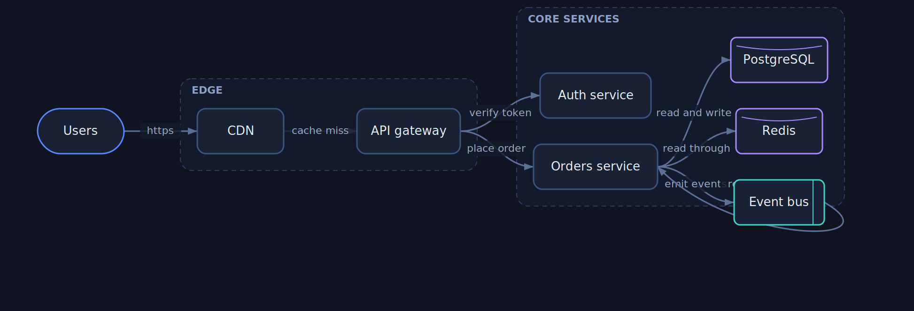
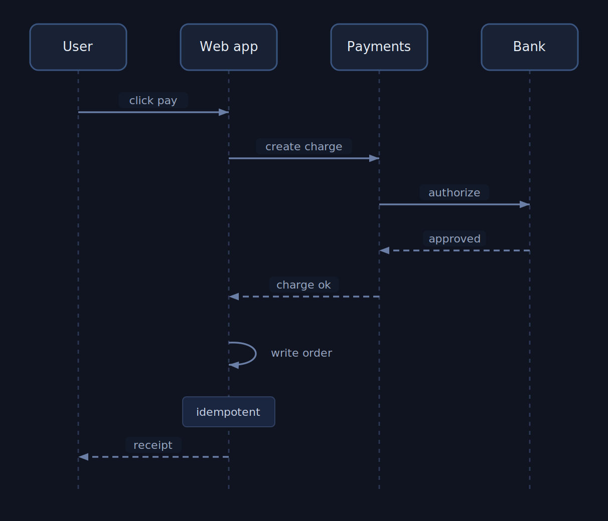
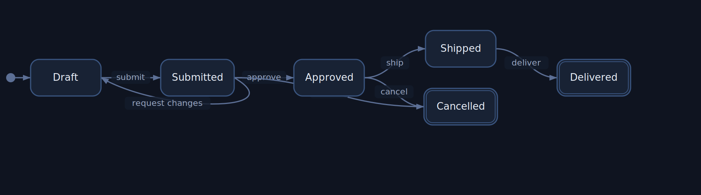
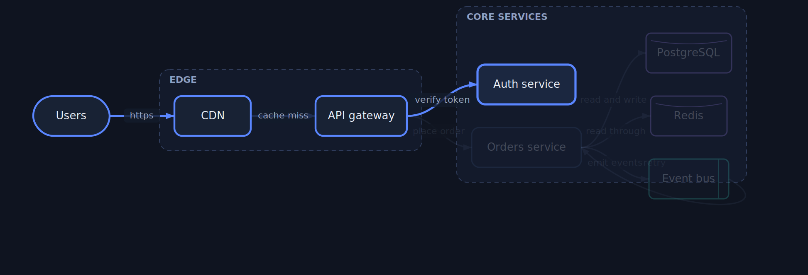
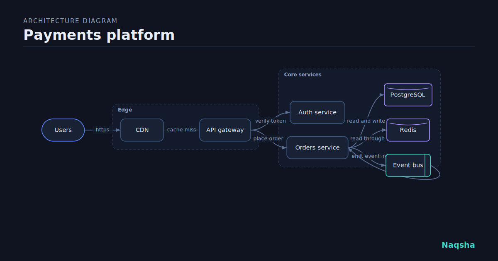
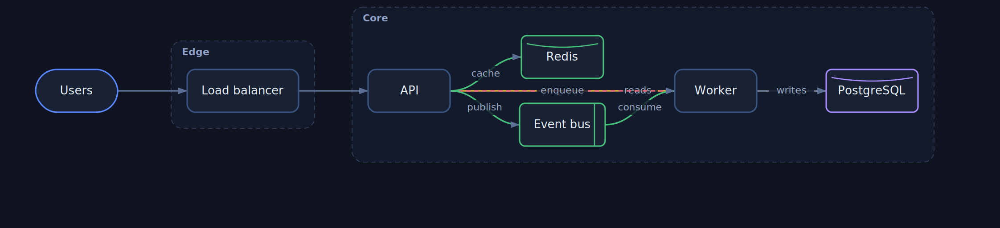

# Naqsha

**Diagrams as code.** Describe a system in a few lines of text and Naqsha turns it into a polished, interactive diagram you can actually explore: pan and zoom, click a node to trace everything it reaches upstream and downstream, search, switch between dark and light themes, and export a clean SVG or PNG. The command line turns the same source into one self contained HTML file you can open anywhere, with no server and no network. Zero dependencies.

Naqsha is the Arabic and Urdu word for a map or a blueprint.

### Try it in your browser

**[siteq8.github.io/Naqsha](https://siteq8.github.io/Naqsha/)**

Type a source on the left and the diagram updates as you go. Nothing you type leaves your browser.



## The idea

A diagram is the fastest way to explain a system, and the slowest thing to keep current. The picture in the wiki drifts from the code the moment someone ships. Tools like Mermaid fixed half of this by letting you write the diagram as text, so it lives in the repository and changes in a pull request. Naqsha takes the same idea and asks for more from the result.

The output is not a flat image. It is a diagram you can read actively. Click any node and Naqsha traces exactly what it depends on and what depends on it, and dims everything else, so a dense architecture becomes legible one question at a time. Search jumps to a service by name. A theme toggle moves between dark and light. And the whole thing is one self contained HTML file: no build step, no hosting, no runtime. Open it, explore it, mail it to a colleague, drop it in a release.

You write this:

```
title Payments platform
direction LR

Use `direction RL` for diagrams that read right to left, which suits Arabic, Hebrew, and Persian labels: graphs and state machines mirror across their width, sequence diagrams put the first participant on the right and their messages flow leftwards.

Groups can nest: `group edge "Edge" parent=souq` puts one group inside another. A parent wraps its own nodes and its child groups with room for every label, parents draw first so children sit on top, and nodes of sibling groups stay together under their common ancestor. Unknown or circular parents are ignored.

group edge "Edge"
group core "Core services"

node users "Users" shape=actor
node cdn "CDN" group=edge
node api "API gateway" group=edge
node auth "Auth service" group=core
node orders "Orders service" group=core
node db "PostgreSQL" shape=store group=core
node cache "Redis" shape=store group=core
node bus "Event bus" shape=queue

edge users -> cdn "https"
edge cdn -> api "cache miss"
edge api -> auth "verify token"
edge api -> orders "place order"
edge orders -> db "read and write"
edge orders -> cache "read through"
edge orders -> bus "emit events"
edge bus -> orders "retry"
```

and you get a laid out, grouped, explorable diagram of it.

## The source language

A source is a plain text file. Every line is one statement, and anything after a hash is a comment.

A **node** is a box in the diagram: `node <id> "Label"`, with an optional `group=<id>` and an optional `shape=`. The shapes are box (the default), round, store, queue, actor, and diamond, so a data store, a queue, an external actor, and a decision each read differently at a glance. An **edge** is a directed connection: `edge <a> -> <b> "optional label"`, and the short form `a -> b` works too. A **group** draws a labelled box around related nodes: `group <id> "Label"`. Two lines at the top set the mood: `title` names the diagram and `direction` is LR for left to right or TB for top to bottom.

Any node you mention in an edge is created automatically, so a quick sketch is just a handful of arrows.

## Sequence diagrams

Set `type sequence` and Naqsha draws a sequence instead of a graph. Participants sit across the top, each with a lifeline running down the page, and messages are arrows between them, ordered top to bottom in the order you wrote them, so the vertical axis is time. A solid arrow is a call, a dashed arrow written with two dashes reads as a return or an asynchronous message, a message from a participant to itself draws as a small self loop, and a note over a participant places a labelled box on its lifeline.

```
type sequence
title Checkout
participant user "User"
participant web "Web app"
participant pay "Payments"
participant bank "Bank"
user -> web "click pay"
web -> pay "create charge"
pay -> bank "authorize"
bank --> pay "approved"
pay --> web "charge ok"
web -> web "write order"
note over web "idempotent"
web --> user "receipt"
```



The viewer works here too. Click a participant to light every message it takes part in and the participants at the other end, and search, theme, and export behave the same as in a graph.

## State machines

Set `type state`, or `type lifecycle`, for a state machine. States are boxes, transitions are labelled arrows, a small filled dot marks the initial state, and a final state gets a second inner outline. Because a state machine is a directed graph, the viewer treats it as one: click a state to trace every state reachable from it and every state that leads to it, which answers questions like where a stuck order can still go.

```
type state
title Order lifecycle
direction LR

initial draft
state draft "Draft"
state submitted "Submitted"
state approved "Approved"
state shipped "Shipped"
final delivered "Delivered"
final cancelled "Cancelled"

draft -> submitted "submit"
submitted -> approved "approve"
submitted -> draft "request changes"
approved -> shipped "ship"
shipped -> delivered "deliver"
approved -> cancelled "cancel"
```



## The interactive viewer

Every diagram, in the browser and in the exported file, comes with the same viewer.

Pan by dragging the background and zoom with the wheel or the plus, minus, and reset controls. Click a node to focus it: Naqsha follows the edges to compute everything it reaches downstream and everything that reaches it upstream, lights that path, and dims the rest. Click the background to clear. Search filters the nodes by name. The theme button switches between dark and light. Export gives you a clean SVG, or a PNG at twice the resolution, always the full diagram rather than the current pan and zoom. In the generated file the keyboard works too: `/` to search, `T` for theme, `F` for flow, `+`, `-`, and `0` to zoom, and `Escape` to clear.



Above: focusing one service lights its upstream path and dims the rest, so you can read a dense diagram one question at a time.

## Share cards

Any diagram can be exported as a share card, a 1200 by 630 image sized for a README banner or a link preview. In the browser the Card button writes a PNG. On the command line, `naqsha card` writes a self contained SVG whose colors are baked in rather than left to a stylesheet, so it renders in any tool.

```
naqsha card system.naqsha -o card.svg
```



## Before and after

Point Naqsha at two snapshots of the same graph and it shows what changed. Nodes and edges that were added are green, ones that were removed are red and dashed, ones whose label changed are amber, and the rest stay as they were. The union of both snapshots is laid out once so the picture holds still, and the generated file has three view modes, Before, After, and Delta, so you can look at either version alone or at the change itself. This is meant for a pull request: keep the diagram as a source file and compare two revisions of it.

```
naqsha diff before.naqsha after.naqsha -o change.html
```



Diffing is for the graph type.

## Motion

The Flow button, or the `F` key in a generated file, animates every connection so its dashes travel toward the arrowhead. It is a quick way to show direction during a walkthrough or a presentation, and it works in every diagram type, on graph edges, sequence messages, and state transitions alike. It is off by default and honors a reduced motion preference, so it never animates for someone who has asked their system to keep motion still.

## Install and use

Naqsha needs Node 18 or newer and nothing else.

Run it without installing:

```
npx github:SiteQ8/Naqsha render system.naqsha -o system.html
```

Or clone it:

```
git clone https://github.com/SiteQ8/Naqsha.git
cd Naqsha
node bin/naqsha.mjs render examples/payments.naqsha -o payments.html
```

Commands:

```
naqsha render <source> [-o out.html] [--theme dark|light]   build a self contained diagram
naqsha example [-o file.naqsha]                             print a source to start from
naqsha card <source> [-o card.svg] [--theme dark|light]     a 1200 by 630 share image
naqsha diff <before> <after> [-o out.html]                  show what changed between two graphs
naqsha serve [--port 8300] [--open]                         run the browser playground locally
naqsha version
```

`render` writes a single HTML file with the diagram, the styles, and the viewer all inlined. Open it in any browser.

## Use it from an agent

Naqsha ships with an agent skill at [skill/SKILL.md](skill/SKILL.md). It teaches an assistant, such as Claude or a coding agent, the source language for all three diagram types and the commands to render a diagram, export a share image, and diff two revisions, so the assistant can turn a request like "diagram this architecture" into a real Naqsha source and a self contained HTML diagram. Point your assistant at that file, or drop it into a tool that loads skills. Every diagram source in the skill is checked against the real engine, so the examples it learns from are known to render.

## Honest scope

Naqsha draws three diagram types today. The graph type covers architecture maps, service dependencies, pipelines, and anything else that is nodes and directed edges; its layout is a compact layered algorithm in the spirit of the Sugiyama method, a good automatic starting point rather than a hand tuned drawing, so a large or unusual graph may want splitting or a nudge in the source. The sequence type covers calls between participants over time. The state type covers a lifecycle or state machine: states, labelled transitions, an initial state, and final states. The viewer reflects the diagram you wrote, not a running system.

A data flow type and finite motion along edges are the natural next steps, and the engine is built around a diagram type so they slot in cleanly. The approach here, a typed source compiled deterministically into a self contained, explorable HTML diagram, was inspired by the excellent [Archify](https://github.com/tt-a1i/archify); Naqsha is a smaller, independent take on that idea, in a single shared engine with no dependencies.

## License

MIT. See [LICENSE](LICENSE).
